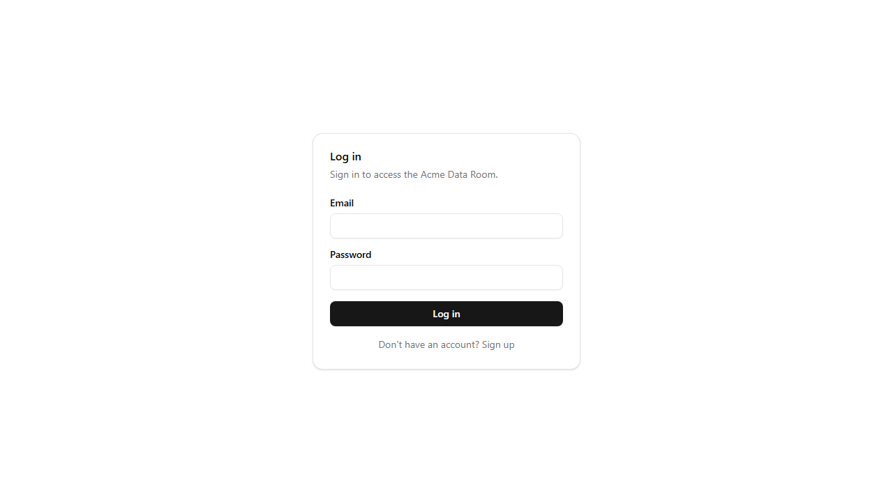
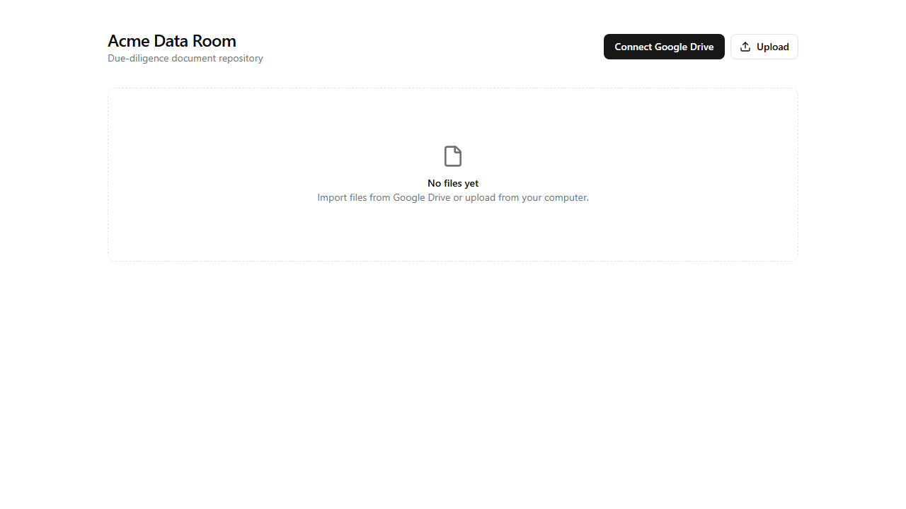
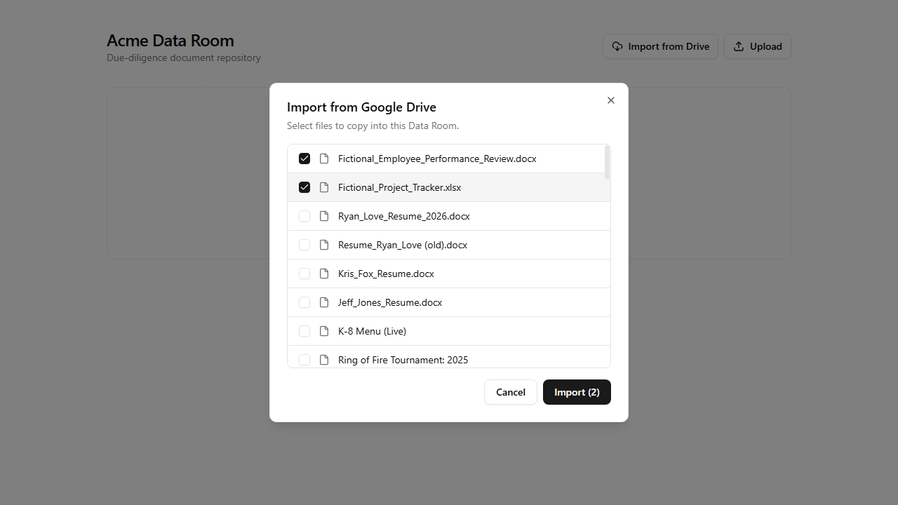
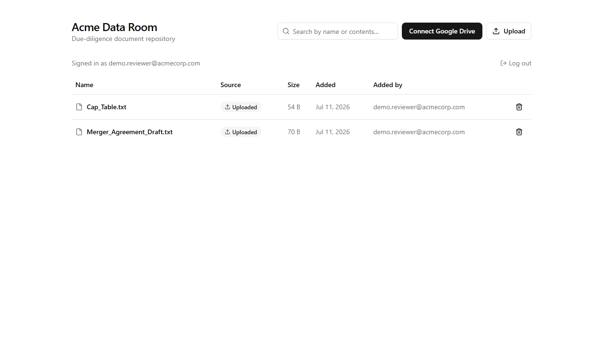
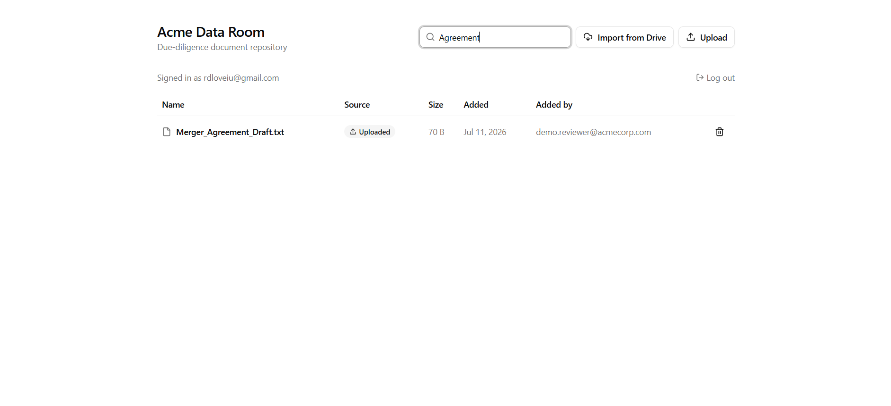
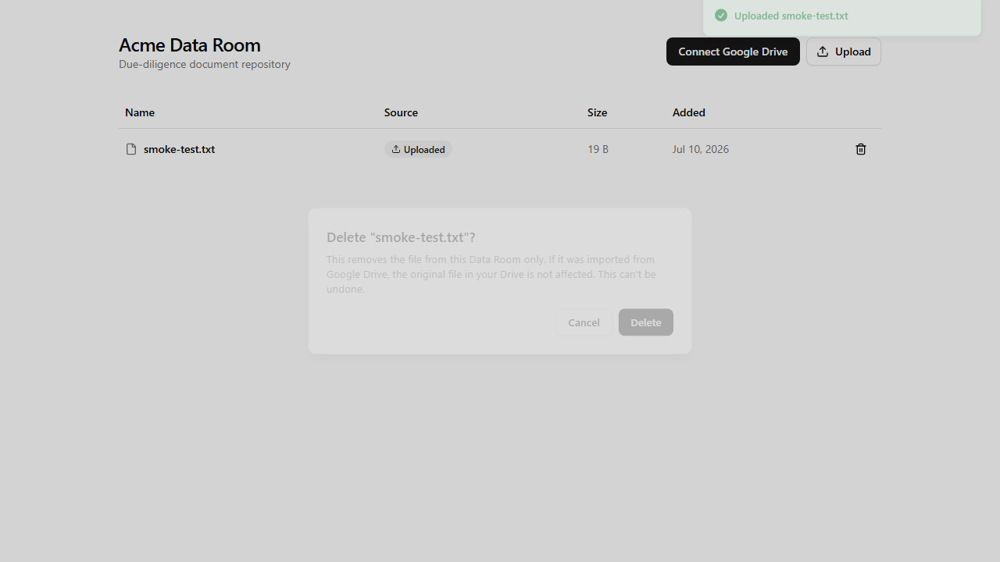

# Acme Data Room

A due-diligence document repository: sign in, import files from Google Drive or upload from
your computer, search across filenames and file contents, view files in the browser, and
delete them from the room (without touching the Drive originals).

Backend: Flask / SQLAlchemy / Postgres. Frontend:
React / TypeScript / Vite / Tailwind / shadcn-ui.

## Live demo

- App: https://frontend-psi-eight-94.vercel.app
- API: https://acme-dataroom-api.onrender.com

Both are on free tiers, which means two things worth knowing before you click around:

- **The Render backend spins down after 15 minutes idle** and takes ~50s to wake back up on
  the next request — the first click after a while looks stuck; it isn't.
- **Uploaded/imported file bytes don't survive that spin-down** (Render's free tier has no
  persistent disk; see "Design decisions" below). File names/metadata persist in Postgres,
  but viewing a file after an idle period may 404 until you re-import it. A paid Render plan
  with a persistent disk fixes this; documented here as a known tradeoff of local-disk storage
  on a free host, rather than worked around.
- **The Google OAuth consent screen is in Testing mode** (not yet through Google's
  verification review, which is a longer process meant for production apps). Only Google
  accounts added as test users in the Cloud Console can complete the "Connect Google Drive"
  flow — let me know your Google account email and I'll add it if you want to test that part.
  Sign-up/login, upload, search, view, and delete all work for anyone regardless.
- **Sign up with any email/password** — there's no email verification step yet, so any
  well-formed email works. The data room is shared: every signed-up user sees the same files,
  matching how a real due-diligence data room works for a deal team.








## Architecture

```
frontend/   Vite + React + TS SPA (shadcn/ui components, Tailwind v4)
backend/    Flask API, SQLAlchemy models, Flask-Migrate migrations
```

The frontend never talks to Google directly. All Drive access — OAuth, listing, downloading
— goes through the Flask backend, which is the only thing holding credentials. This keeps
the OAuth client secret and the long-lived refresh token off the browser entirely.

### Data model

**`users`** — `email` (unique) + `password_hash` (werkzeug's `generate_password_hash`,
salted). Auth is a plain server-side session (signed cookie, `session["user_id"]`), not
JWTs — simplest thing that works for a same-app cookie-based session, and it's the same
mechanism already used for OAuth CSRF state, so no new auth framework was pulled in.

**`files`** — one row per file in the data room, regardless of where it came from. The room
is shared: every signed-up user sees every file (see "Login system" below for why), but each
row still tracks `uploaded_by_id` so the UI can show who added what.
- `source`: `upload` or `google_drive`
- `google_file_id`: set only for Drive imports; used to make re-importing the same file
  idempotent (importing twice returns the existing row instead of duplicating)
- `storage_path`: a random UUID, decoupled from the user-facing `name` — avoids filesystem
  collisions/traversal from untrusted filenames and means renaming never touches disk
- `content_text`: best-effort extracted text (pdf/docx/txt) used for content search, see below
- `deleted_at`: soft delete. The physical file is removed from disk immediately (so storage
  doesn't grow unbounded), but the DB row is kept for an audit trail — appropriate for a
  due-diligence context where "what was in the room and when" can matter, even for
  something later removed. Hard delete would be a reasonable simpler choice too; this is the
  one tradeoff I'd flag as worth revisiting with the team.

**`google_oauth_tokens`** — one Drive connection per user (`user_id` FK, unique), not global.
Each person connects their *own* Drive to import from, even though the room they import into
is shared. `access_token` and `refresh_token` are encrypted at rest (Fernet symmetric
encryption, key from `TOKEN_ENCRYPTION_KEY`) since a stolen DB backup shouldn't be enough to
impersonate the OAuth grant.

## Design decisions worth calling out

- **OAuth scope: `drive.readonly`, not `drive.file`.** I started with `drive.file`
  (narrowest possible grant) but it only lets `files.list()` see files the app has already
  touched — it can't browse a user's existing Drive. That only works if you use Google's
  official Picker widget, which handles per-file grants internally. Since this app implements
  its own file browser instead, listing arbitrary existing files needs `drive.readonly`: full
  read access, no write/delete capability in Drive. Documented in `app/google_client.py`.
- **Token refresh is centralized.** Every Drive-touching route goes through
  `google_client.get_credentials()`, which transparently refreshes an expired access token
  and persists the new one. If the *refresh* token itself is invalid (revoked by the user,
  or otherwise dead), the stale row is deleted and a 401 is returned with a machine-readable
  code
  (`drive_reauth_required` / `drive_not_connected`) that the frontend uses to reset to a
  clean "reconnect" state rather than showing a raw error.
- **Google-native files (Docs/Sheets/Slides) are exported, not downloaded.** They have no
  underlying bytes to fetch directly — `download_drive_file()` detects the native mimetypes
  and calls Drive's `export` endpoint instead (Docs → PDF, Sheets → xlsx, Slides → pptx).
  Folders are excluded from the picker entirely (recursive folder import is out of scope for
  this MVP).
- **Idempotent import.** Re-importing a Drive file you've already imported returns the
  existing row rather than creating a duplicate, keyed on `google_file_id`.
- **Login system: shared room, per-user Drive connections.** A due-diligence data room is
  inherently a multi-party space (deal team, lawyers, bankers all looking at the same
  documents), so login gates *who* can see the room rather than partitioning it per user —
  any authenticated user can see, import, upload, and delete any file. What *is* scoped
  per-user is the Google Drive connection itself (`google_oauth_tokens.user_id`, unique),
  since "import from Drive" naturally means "my Drive." A stricter permissions model
  (owner-only delete, roles) is the natural next step, not implemented here to keep the MVP
  scope bounded.
- **Cross-origin session cookies.** The frontend (Vercel) and backend (Render) are different
  origins in production, so the session cookie needs `SameSite=None; Secure` to be sent on
  cross-site `fetch()` calls — but `Secure` cookies require HTTPS, which local dev over plain
  `http://localhost` doesn't have. `app/__init__.py` switches between `SameSite=Lax` locally
  and `SameSite=None; Secure` in production, keyed off the `RENDER` env var Render sets
  automatically on every deploy. Missing this would make login *appear* to work (the request
  that sets the cookie succeeds) while every subsequent cross-origin request silently drops
  it — a failure mode that's easy to miss testing only same-origin locally.
- **Search: trigram index, not full-text search.** `files.name` and `files.content_text` are
  matched with `ILIKE '%term%'`, backed by a Postgres `pg_trgm` GIN index rather than
  `tsvector`/`to_tsquery`. Tsvector does stemmed *word* matching, which is a worse fit here
  than substring matching for partial filenames and short content snippets, and trigram
  indexes make `ILIKE` substring search fast without needing separate query syntax.
- **Content extraction is best-effort and synchronous.** `app/text_extract.py` pulls text out
  of pdf/docx/txt at upload/import time (pypdf / python-docx) and stores it in
  `content_text`. Extraction failures or unsupported types (xlsx, images, pptx) just leave it
  `null` — never blocks the upload itself. Doing this synchronously in the request is fine at
  MVP scale; a production version would queue it as a background job so a large PDF doesn't
  hold the HTTP request open.

## Known limitations / what I'd do with more time

- No pagination in the Drive picker beyond the first 50 results (the API supports
  `pageToken`; the frontend doesn't request more pages yet).
- No roles/permissions within the data room — any logged-in user can delete any file. A real
  version would add an owner/admin distinction.
- Content search covers pdf/docx/txt only (not xlsx/pptx/images) — see "Content extraction"
  above.
- Large uploads/downloads are synchronous within the request; a production version would
  background large Drive exports and text extraction.
- No email verification or password reset flow on signup/login.

## Setup

### Prerequisites

- Node.js 20+
- Python 3.11+
- PostgreSQL (running locally, or any reachable instance)
- A Google Cloud project with the Drive API enabled and an OAuth 2.0 Web client (see below)

### 1. Google OAuth client

1. [console.cloud.google.com](https://console.cloud.google.com) → new project.
2. **APIs & Services → Library** → enable **Google Drive API**.
3. **APIs & Services → OAuth consent screen** → External → add yourself as a **test user**
   (keeps the app out of Google's verification review while testing).
4. **APIs & Services → Credentials → Create Credentials → OAuth client ID** → Web
   application → authorized redirect URI: `http://localhost:5000/api/auth/google/callback`
   (adjust host/port to match your backend if different).
5. Note the Client ID and Client Secret.

### 2. Database

```bash
createdb dataroom
# or, via psql:
psql -U postgres -c "CREATE DATABASE dataroom;"
```

### 3. Backend

```bash
cd backend
python -m venv venv
venv\Scripts\activate        # Windows
# source venv/bin/activate   # macOS/Linux

pip install -r requirements.txt
cp .env.example .env         # fill in DATABASE_URL, GOOGLE_CLIENT_ID/SECRET, and generate the two keys below
```

Generate the two secrets referenced in `.env.example`:

```bash
python -c "import secrets; print(secrets.token_hex(32))"                              # FLASK_SECRET_KEY
python -c "from cryptography.fernet import Fernet; print(Fernet.generate_key().decode())"  # TOKEN_ENCRYPTION_KEY
```

```bash
flask db upgrade      # apply migrations
python run.py         # starts on http://localhost:5000
```

### 4. Frontend

```bash
cd frontend
npm install
cp .env.example .env.local   # VITE_API_URL=http://localhost:5000/api
npm run dev                  # starts on http://localhost:5173
```

Open http://localhost:5173, sign up with any email/password, then click **Connect Google
Drive** and go.

## API summary

| Method | Path | Purpose |
|---|---|---|
| POST | `/api/auth/register` | Create an account `{email, password}` |
| POST | `/api/auth/login` | Log in `{email, password}` |
| POST | `/api/auth/logout` | Clear the session |
| GET | `/api/auth/me` | Current logged-in user |
| GET | `/api/auth/google/status` | Is *my* Drive connected? |
| GET | `/api/auth/google/login` | Redirect to Google consent |
| GET | `/api/auth/google/callback` | OAuth callback (Google → here) |
| POST | `/api/auth/google/disconnect` | Clear my stored token |
| GET | `/api/drive/files` | List my Drive files (paginated) |
| POST | `/api/drive/import` | Import a Drive file by `fileId` |
| GET | `/api/files?q=term` | List/search files in the data room (name + content) |
| POST | `/api/files/upload` | Upload a local file (multipart) |
| GET | `/api/files/:id` | Stream a file for in-browser viewing |
| DELETE | `/api/files/:id` | Remove a file from the data room |

All routes except `register`/`login` require an authenticated session.
